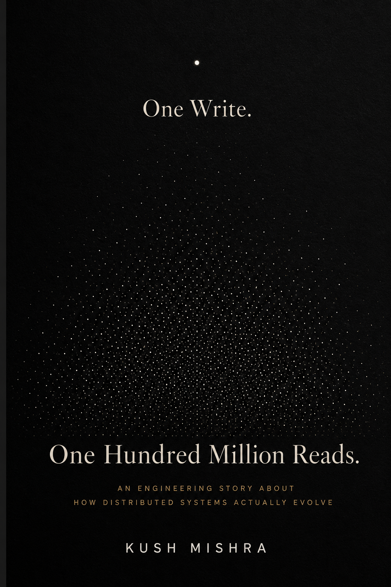

# One Write. One Hundred Million Reads.

> An Engineering Story About How Distributed Systems Actually Evolve.

## Why this book?

Most distributed systems books teach individual technologies.

They explain Redis.

Kafka.

PostgreSQL.

Load balancers.

Consensus.

Caching.

Replication.

But production systems don't evolve one technology at a time.

They evolve through decisions.

One write.

One bottleneck.

One outage.

One migration.

One cache.

One queue.

One compromise after another.

This book follows that journey.

Starting from a single backend server, we gradually evolve the architecture into the kinds of systems that power modern internet-scale applications.

Instead of memorizing technologies, the goal is to understand *why* they become necessary.

---

## Who is this for?

This book is written for:

- Backend Engineers
- Software Engineers
- System Design interview candidates
- Engineering students
- Senior engineers transitioning into distributed systems
- Anyone curious about how real backend systems evolve

No prior experience with distributed systems is required.

---

## What you'll learn

The journey covers topics including:

- Building the first backend service
- Databases
- Indexing
- Caching
- Replication
- Message queues
- Event-driven architecture
- Distributed transactions
- CAP theorem
- Consensus
- Leader election
- Service discovery
- Sharding
- Observability
- Scaling to millions of requests

Each concept is introduced only when the architecture naturally demands it.

---

## Download

The latest PDF is available here https://github.com/dunk066/One-Write-One-Hundred-Million-Reads/blob/main/One-Write-One-Hundred-Million-Reads.pdf.

---

## Feedback

This is the **First Edition**.

Rather than spending years polishing the book in isolation, I'd rather get it into the hands of engineers and let real feedback shape future editions.

If you find:

- technical inaccuracies
- unclear explanations
- mistakes
- ideas that can be explained better

please open an Issue or start a Discussion.

I read every piece of feedback.

---

## About the Author

Kush Mishra is a backend software engineer specializing in distributed systems, event-driven architectures, and large-scale backend infrastructure. He has built systems processing millions of events per hour, led large-scale backend migrations, and enjoys breaking down complex engineering ideas into intuitive mental models.

This is his first book.

---

## License

© Kush Mishra.

The PDF may be freely shared in its original, unmodified form.

Please do not redistribute modified versions without permission.

---

If this book helps you understand distributed systems a little better, I'd love to hear about it.

Happy reading.
